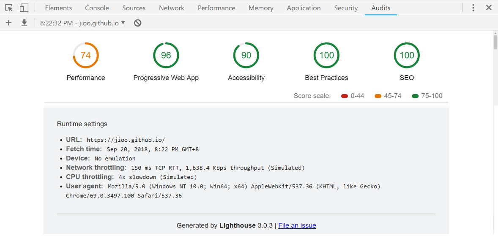

## Justine Joshua Quiazon ##

My portfolio website using Vue, Vuetify &amp; Vue-Cli-3

url: <a href="https://jioo.github.io/" target="_blank">https://jioo.github.io/</a>

## Google's Lighthouse Score ##



## Features ##

* Material design with Vuetify CSS Framework
* (WebGL) Web Graphics Library
* (PWA) Progressive Web Application 
  * Service Worker for Offline mode
  * Mobile-friendly meta-viewport
  * Web Application Manifest + favicons

## Includes ##

* [Vue.js](https://vuejs.org/) The Progressive JavaScript Framework.
* [Vue CLI 3](https://cli.vuejs.org/) Standard Tooling for Vue.js Development.
* [Vue-Router](https://router.vuejs.org/en/) Vue Router is the official router for Vue.js.
* [Vuetify](https://vuetifyjs.com/en/) Material Design Component Framework.
* [Vue-Meta](https://github.com/declandewet/vue-meta) Manage page meta info in Vue.
* [Vue-Analytics](https://github.com/MatteoGabriele/vue-analytics) Google Analytics plugin for Vue.
* [Vue-Typer](https://github.com/cngu/vue-typer) Vue component that simulates a user typing.
* [Vue-Particles](https://github.com/creotip/vue-particles) Vue component for particles backgrounds.
* [Three.js](https://threejs.org/) JavaScript 3D library.
* [TweenMax](https://greensock.com/tweenmax) Animation library.
* [Decorative Backgrounds](https://github.com/Mamboleoo/DecorativeBackgrounds/)

## Installation
```
git clone https://github.com/jioo/justine-joshua-quiazon.git
cd justine-joshua-quiazon

# Install Dependencies
npm install

# Compiles and hot-reloads for development
npm run serve
```