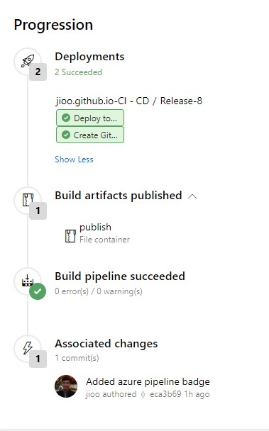

## Justine Joshua Quiazon ##

My portfolio website using Vue, Vuetify &amp; Vue-Cli-3

[](https://jioqzn-yahoo.visualstudio.com/jioo.github.io/_build/latest?definitionId=10&branchName=master) [](http://paypal.me/jjquiazon)

url: <a href="https://jioo.github.io/" target="_blank">https://jioo.github.io/</a>

## Azure CI-CD Pipeline ##
- [Continous Integration Link](https://jioqzn-yahoo.visualstudio.com/jioo.github.io/_build)
- [Continous Deployment Link](https://jioqzn-yahoo.visualstudio.com/jioo.github.io/_release)

**Workflows:**
1. Build Web App
2. Publish Artifact from `/dist` folder
3. Push Artifact contents in GH Page Repository: `https://github.com/jioo/jioo.github.io`
4. Create Github Release



## Google's Lighthouse Score ##


## Features ##

* Material design with Vuetify CSS Framework
* (WebGL) Web Graphics Library
* (PWA) Progressive Web Application 
  * Service Worker for Offline mode
  * Mobile-friendly meta-viewport
  * Web Application Manifest + favicons

## Includes ##

* [Vue.js](https://vuejs.org/) The Progressive JavaScript Framework.
* [Vue CLI 3](https://cli.vuejs.org/) Standard Tooling for Vue.js Development.
* [Vue-Router](https://router.vuejs.org/en/) Vue Router is the official router for Vue.js.
* [Vuetify](https://vuetifyjs.com/en/) Material Design Component Framework.
* [Vue-Meta](https://github.com/declandewet/vue-meta) Manage page meta info in Vue.
* [Vue-Analytics](https://github.com/MatteoGabriele/vue-analytics) Google Analytics plugin for Vue.

## Installation
```
git clone https://github.com/jioo/justine-joshua-quiazon.git
cd justine-joshua-quiazon

# Install Dependencies
npm install

# Compiles and hot-reloads for development
npm run serve

# Build production and serve in HTTP server
npm run build
```
